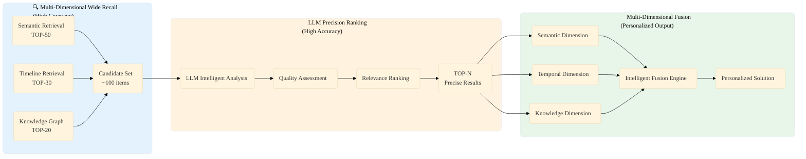
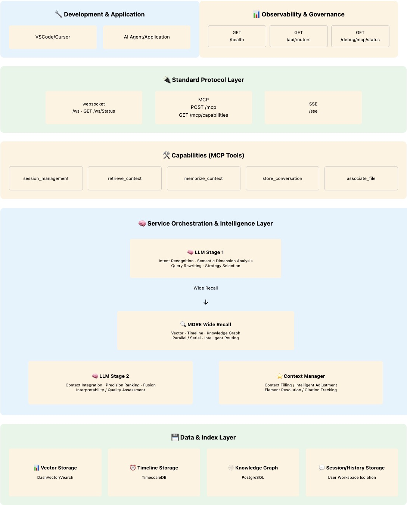
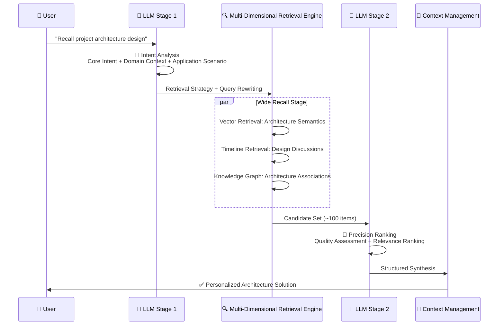
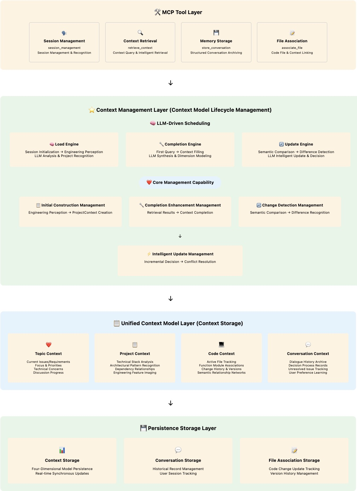
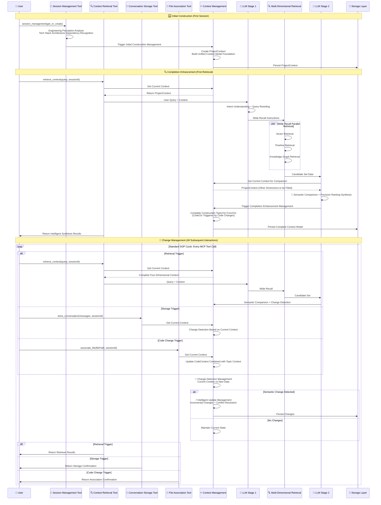
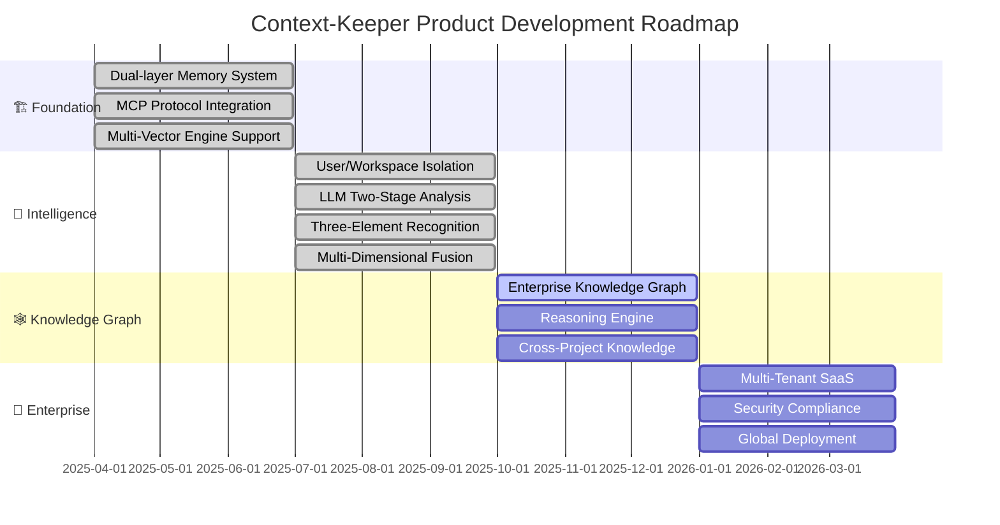
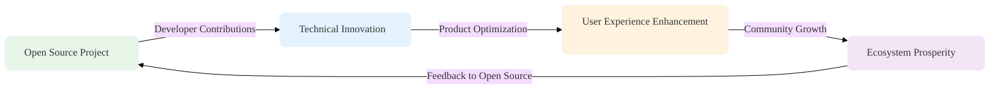

<div align="center" style="margin: 40px 0;">

<div style="display: flex; align-items: center; justify-content: center; gap: 20px; margin-bottom: 30px;">

<span style="font-size: 48px; font-weight: bold; color: #1e293b;">Context-Keeper</span>
</div>

**LLM-Driven Intelligent Memory & Context Management System**

*Redefining AI Assistant Memory Boundaries - Making Every Conversation Meaningful*

**Language**: [English](README-EN.md) | [简体中文](README.md)

[](https://github.com/redleaves/context-keeper)
[](LICENSE)
[](https://golang.org/)
[](https://github.com/modelcontextprotocol)

[🚀 Quick Start](#5-minute-quick-start) • [💡 Core Features](#2-core-features) • [🏗️ Architecture](#3-architecture-design) • [📖 Deployment](#4-deployment--integration) • [🗺️ Roadmap](#5-product-roadmap)

</div>

---

## 📋 **Table of Contents**

- [🎯 Why Context-Keeper?](#1-ai-development-challenges-when-intelligent-tools-meet-memory-gaps)
- [🎯 Core Features](#2-core-features)
- [🏗️ Architecture Design](#3-architecture-design)
- [📖 Deployment & Integration](#4-deployment--integration)
- [🗺️ Product Roadmap](#5-product-roadmap)
- [🤝 Contributing](#6-contributing-guide)

---

## 1. AI Development Challenges: When Intelligent Tools Meet Memory Gaps

> **"Do you remember the microservices architecture we discussed yesterday?"** → "Sorry, I don't remember..." → 😤

### 📊 **Four-Dimensional Pain Points: Which One Are You?**

<div align="center">

|  | 👤 **Individual Developer** | 👥 **Team Leader** | 🏗️ **Project Manager** | 🏢 **Enterprise Executive** |
|------|-----------------|----------------|----------------|----------------|
| **💔 Core Pain Points** | 🔄 **Daily Repetition**: Explaining project context to AI<br/>🧠 **Context Loss**: AI can't understand development intent<br/>🌀 **Redundant Work**: Solving similar problems repeatedly | 📚 **Knowledge Gap**: Senior experience can't be inherited<br/>💬 **High Communication Cost**: Repeatedly explaining same issues<br/>🚫 **Decision Delays**: Lack of historical context reference | 🔧 **Technical Debt**: Unknown reasons for historical decisions<br/>⏱️ **Project Delays**: Long onboarding cycle for new members<br/>📋 **Documentation Lag**: Code and docs out of sync | 💸 **Talent Loss**: Core knowledge leaves with personnel<br/>📈 **ROI Decline**: Cross-project best practices hard to reuse<br/>🎯 **Competitive Disadvantage**: Innovation speed slowed down |
| **⚡ Direct Impact** | **🔥30% Development Time Wasted** | **📉Team Efficiency Down 40%** | **💰Project Cost 2x Over Budget** | **⏰Talent Training Cost 6-12 Months** |

</div>

### 🔥 **Industry Status Data**

- 📊 **50% of developers** repeat project context explanations to AI assistants daily
- 💰 **Average Cost**: Replacing a senior engineer takes 6-12 months
- ⏱️ **Time Loss**: New members need 3-6 months to fully understand complex projects
- 🔄 **Repetitive Work**: 30-40% of technical issues in teams are repetitive

**Core Problem**: AI tools lack continuous memory capabilities and cannot form intelligent knowledge accumulation and inheritance systems. Facing these challenges, we need not another memory tool, but a truly intelligent brain that understands developer intent.

🚀 **Context-Keeper: Breaking Traditional Boundaries with Intelligent Solutions**

---

## 2. Core Features



### 🚀 **Three Core Breakthroughs**

| Breakthrough | Traditional Solution Pain Points | **Context-Keeper Solution** | Core Advantage |
|-------|------------|-------------------------|---------|
| **🧠 Intelligent Reasoning** | Mechanical matching, unable to understand intent | **LLM Deep Reasoning**: Understands development scenarios and project context | 75%+ Accuracy |
| **⚡ Wide Recall + Precision Ranking** | Contradiction between recall and accuracy | **Two-Stage Architecture**: Wide recall (100 items) → Precision ranking (TOP-N) | 80%+ Coverage |
| **🎯 Multi-Dimensional Fusion** | Single semantic retrieval, isolated information | **Three-Dimensional Memory Space**: Semantic + Temporal + Knowledge intelligent fusion | 3x Association Discovery Rate |

> Note: The above metrics are internal benchmark results under specific evaluation scenarios; actual results may vary by dataset, model and environment (scenario-scope).

### 🎯 **Business Value**

#### **Value for Development Teams**

| Application Scenario | Developer Question | Context-Keeper Intelligent Response | Value Demonstration |
|---------|-----------|----------------------|---------|
| **Architecture Decision Review** | "Why choose microservices over monolith?" | Detailed analysis based on March 15th technical review records | 🧠 **Historical Wisdom Reuse** |
| **Bug Fix Reuse** | "How to solve similar performance issues?" | Found 2 related cases and provided solutions | ⚡ **Experience Rapid Reuse** |
| **Technology Selection Reference** | "Redis cluster configuration best practices?" | Project historical config + industry best practices comparison | 🎯 **Decision Support Optimization** |

#### **Value for Enterprises**
- 📈 **Development Efficiency Improvement**: Reduce repetitive explanations and discussions
- 💰 **Human Resource Cost Savings**: Significantly shorten new employee training time
- 🎯 **Decision Quality Enhancement**: Intelligent suggestions based on historical experience
- 🔄 **Knowledge Asset Accumulation**: Systematic precipitation of team wisdom

---

## 3. Architecture Design

Context-Keeper has evolved through two major iterations:

#### **🧠 Phase I Core Design**

**📚 Layered Short-term and Long-term Memory Design**
- **Short-term Memory**: Stores complete recent conversations using local file system for high-speed access
- **Long-term Memory**: Stores key information summaries using vector database for permanent storage
- **Progressive Compression**: Information gradually transforms from detailed short-term records to semantic summaries in long-term memory

**👤 User Isolation & Personalization**
- **Session Isolation**: Each user has independent session space, ensuring data security and privacy protection
- **Workspace Isolation**: Complete isolation of contexts from different projects/workspaces, avoiding information interference
- **Personalized Memory Strategy**: Automatically adjusts memory thresholds and summary strategies based on user work style
- **Cross-session Knowledge Transfer**: Establishes intelligent associations between different sessions of the same user

**🔄 Memory & Batch Management Mechanism**
- **Memory ID (memoryID)**: User perspective "complete memory", corresponding to a work task or topic
- **Batch ID (batchID)**: System perspective "storage unit", corresponding to continuous conversation segments
- **Intelligent Importance Assessment**: Automatically identifies key decision points, ensuring core content is permanently saved

#### **🚀 Phase II LLM-Driven Upgrade**

Context-Keeper is based on **LLM-driven intelligent context memory management system**, achieving two key breakthroughs on Phase I foundation:

🧠 **LLM-Driven Wide Recall + Precision Ranking Architecture** - Building "Intent Understanding → Wide Recall → Precision Ranking → Intelligent Synthesis" LLM-driven architecture

⭐️ **Intelligent Context Management** - Four-dimensional unified context model + LLM-driven full lifecycle intelligent management

---

### 🧠 **3.1 LLM-Driven Wide Recall + Precision Ranking Architecture**

#### **🏗️ Architecture Diagram**

<div align="center">

</div>

#### **⏱️ Sequence Diagram**



#### **📋 Architecture Core Features**

| Layer | Core Capability | Technical Implementation | Performance Advantage |
|------|---------|---------|---------|
| **🧠 Intelligence Layer** | Two-stage LLM collaborative reasoning | Intent analysis + intelligent synthesis division | **75% Accuracy** |
| **🔍 Retrieval Layer** | Multi-dimensional wide recall + precision ranking | Semantic + temporal + knowledge parallel retrieval | **80%+ Recall Rate** |
| **⭐️ Management Layer** | Intelligent context management | Four-dimensional coordination + real-time synchronization | **Response <500ms** |

> Note: Metrics reflect internal benchmarks under controlled scenarios; production performance depends on model choice, hardware and configuration (scenario-scope).

### 📋 **3.2 Intelligent Context Management**

Context-Keeper builds a **four-dimensional unified context model** as the carrier of context information, implementing full lifecycle management of context from initial construction → completion → intelligent analysis & context updates (cyclical) through LLM-driven intelligent management mechanisms.

**Core Design**:
- 🏗️ **Unified Context Model**: Four-dimensional collaborative data storage foundation
- 🔄 **Intelligent Management Process**: LLM-driven full lifecycle management mechanism
- ⚡️ **Real-time Change Perception**: Semantic-level context change detection and updates

#### **🏗️ Intelligent Context Management Layered Architecture**

<div align="center">

</div>

#### **⏱️ Intelligent Context Management Sequence**



**🔥 Management Mechanism Core Advantages**:
- ✅ **Unified Storage Foundation**: Four-dimensional unified context model as data foundation for all management operations
- ✅ **Full Lifecycle Coverage**: Complete management chain from initial construction → completion → cyclical changes
- ✅ **LLM Intelligent Drive**: LLM participates in decision-making at every management stage, not traditional rule engines
- ✅ **Real-time Change Perception**: Context change detection based on semantic analysis
- ✅ **Conflict-free Merging**: LLM-driven intelligent conflict resolution and priority arbitration

---

## 4. Deployment & Integration

### 🛠️ **Prerequisites**

Before deploying Context-Keeper, you need to prepare the following infrastructure:

#### **📊 Multi-Dimensional Storage Infrastructure**

**1. Vector Database (Required)**

We designed a unified vector storage interface that **can be extended according to developer/enterprise needs**, supporting multiple vector databases:

- **Alibaba Cloud DashVector**: Quick application through Alibaba Cloud Console
- **JD Cloud Vearch**: Quick application through JD Cloud
- **Custom Implementation Extension**: Extend other vector storage implementations (like Milvus, Weaviate, etc.) based on unified interface

```bash
# Configuration Examples (Choose One)
# Option 1: Use Alibaba Cloud DashVector
VECTOR_STORE_TYPE=aliyun
VECTOR_DB_URL=https://your-instance.dashvector.cn-hangzhou.aliyuncs.com
VECTOR_DB_API_KEY=your-dashvector-api-key

# Option 2: Use JD Cloud Vearch  
VECTOR_STORE_TYPE=vearch
VEARCH_URL=http://your-vearch-instance.jd.local
VEARCH_USERNAME=your-username
VEARCH_PASSWORD=your-password
```

**2. Time-Series Database (Required)**

Self-install: **TimescaleDB/PostgreSQL** (for timeline storage)

**3. Graph Database (Required)**

Self-install: **Neo4j** (for knowledge graph and association analysis)

**4. LLM Model Configuration (Required)**

We support both local and cloud model configurations, **flexibly meeting different scenario requirements**:

**🏠 Local Models (Recommended)**
- Based on **Ollama** framework, fast response, low cost, data security
- Install Ollama: `curl -fsSL https://ollama.ai/install.sh | sh`
- Install models as needed: `ollama pull deepseek-coder-v2:16b`
- Supported models: CodeQwen, DeepSeek Coder, Llama, etc.

**☁️ Cloud Models (Backup)**
- Apply for corresponding LLM vendor API keys
- Support: OpenAI, DeepSeek, Claude, Tongyi Qianwen, etc.
- Simple configuration, on-demand calling

### 🚀 **5-Minute Quick Start**

#### **Environment Requirements**
- Go 1.21+
- 4GB+ Memory
- Docker environment support (optional)

#### **One-Click Local Deployment**

```bash
# 1. Get Context-Keeper
git clone https://github.com/redleaves/context-keeper.git
cd context-keeper

# 2. Environment Configuration (Important!)
cp config/env.template config/.env

# Edit configuration file, fill in necessary parameters
vim config/.env

# 3. One-click startup
./scripts/manage.sh deploy http --port 8088

# 4. Verify deployment
curl http://localhost:8088/health
# Expected output: {"status":"healthy","version":"v2.0.0"}
```

### ⚙️ **Detailed Parameter Configuration**

#### **Real .env Configuration**

Based on the project's actual `config/.env` (sample below):

```bash
# =================================
# Basic Service
# =================================
SERVICE_NAME=context-keeper         # Service name
PORT=8088                           # HTTP port
DEBUG=false                         # Debug mode
STORAGE_PATH=./data                 # Data storage path

# =================================
# Vector Store (Required)
# =================================
# aliyun | vearch
VECTOR_STORE_TYPE=aliyun            # Support DashVector (Aliyun) and Vearch (JD Cloud)

# Aliyun DashVector
VECTOR_DB_URL=https://your-instance.dashvector.cn-hangzhou.aliyuncs.com
VECTOR_DB_API_KEY=your-dashvector-api-key
VECTOR_DB_COLLECTION=context_keeper
VECTOR_DB_DIMENSION=1536
SIMILARITY_THRESHOLD=0.4

# JD Cloud Vearch (optional alternative)
VEARCH_URL=http://your-vearch-instance.jd.local
VEARCH_USERNAME=root
VEARCH_PASSWORD=your-password
VEARCH_DATABASE=db
VEARCH_REQUIRED_SPACES=context_keeper_vector,context_keeper_users

# =================================
# Embedding Service (Required)
# =================================
EMBEDDING_API_URL=https://dashscope.aliyuncs.com/compatible-mode/v1/embeddings
EMBEDDING_API_KEY=your-dashscope-api-key

# Batch embedding (optional)
BATCH_EMBEDDING_API_URL=https://dashscope.aliyuncs.com/api/v1/services/embeddings/text-embedding/text-embedding
BATCH_QUEUE_SIZE=100
BATCH_WORKER_POLL_INTERVAL=5s

# =================================
# LLM (local first; cloud as fallback)
# =================================
LLM_PROVIDER=ollama_local           # Prefer local models
LLM_MODEL=deepseek-coder-v2:16b     # Local code-understanding model
LLM_MAX_TOKENS=80000
LLM_TEMPERATURE=0.1
LLM_TIMEOUT_SECONDS=600

# Cloud model API keys (fallback)
DEEPSEEK_API_KEY=your-deepseek-key
OPENAI_API_KEY=your-openai-key
CLAUDE_API_KEY=your-claude-key

# Timeline storage (TimescaleDB/PostgreSQL)
TIMELINE_STORAGE_ENABLED=true
TIMESCALEDB_HOST=localhost
TIMESCALEDB_PORT=5432
TIMESCALEDB_DATABASE=context_keeper_timeline
TIMESCALEDB_USERNAME=your-username
TIMESCALEDB_PASSWORD=your-password

# Knowledge graph storage (Neo4j)
KNOWLEDGE_GRAPH_ENABLED=true
NEO4J_URI=bolt://localhost:7687
NEO4J_USERNAME=neo4j
NEO4J_PASSWORD=your-neo4j-password
NEO4J_DATABASE=neo4j

# =================================
# Session management
# =================================
SESSION_TIMEOUT=120m                # Session timeout
CLEANUP_INTERVAL=30m                # Cleanup interval
SHORT_MEMORY_MAX_AGE=3              # Short-term memory retention days
```

#### **LLM Model Selection Configuration**

From `config/llm_config.yaml` (local-first with cloud fallback):

```yaml
llm:
  default:
    primary_provider: "ollama_local"    # Prefer local models
    fallback_provider: "deepseek"       # Cloud model as fallback

  providers:
    # Local models (recommended)
    ollama_local:
      base_url: "http://localhost:11434"
      model: "deepseek-coder-v2:16b"
      timeout: "60s"
      rate_limit: 0
      available_models:
        - "codeqwen:7b"
        - "deepseek-coder:33b"
        - "deepseek-coder-v2:16b"

    # Cloud providers (fallback)
    deepseek:
      api_key: "${DEEPSEEK_API_KEY}"
      model: "deepseek-chat"
      timeout: "120s"
      rate_limit: 6000

    openai:
      api_key: "${OPENAI_API_KEY}"
      model: "gpt-3.5-turbo"

    claude:
      api_key: "${CLAUDE_API_KEY}"
      model: "claude-3-sonnet-20240229"
```

#### **Parameter Reference**

| Category | Key | Required | Description | Default |
|---------|-----|----------|-------------|---------|
| Basic | `SERVICE_NAME` | ✅ | Service name | `context-keeper` |
|  | `PORT` | ✅ | HTTP listen port | `8088` |
|  | `STORAGE_PATH` | ✅ | Data storage directory | `./data` |
| Vector Store | `VECTOR_STORE_TYPE` | ✅ | `aliyun` or `vearch` | `aliyun` |
|  | `VECTOR_DB_URL` | ✅ | DashVector endpoint | - |
|  | `VECTOR_DB_API_KEY` | ✅ | DashVector API key | - |
|  | `VEARCH_URL` | ❌ | Vearch endpoint | - |
|  | `VEARCH_USERNAME` | ❌ | Vearch username | `root` |
| Embedding | `EMBEDDING_API_URL` | ✅ | DashScope embedding endpoint | - |
|  | `EMBEDDING_API_KEY` | ✅ | DashScope API key | - |
| LLM | `LLM_PROVIDER` | ✅ | `ollama_local`/`deepseek`/`openai` | `ollama_local` |
|  | `LLM_MODEL` | ✅ | Model name | `deepseek-coder-v2:16b` |
|  | `LLM_MAX_TOKENS` | ❌ | Max tokens | `80000` |
| Timeline | `TIMELINE_STORAGE_ENABLED` | ✅ | Enable TimescaleDB | `true` |
|  | `TIMESCALEDB_HOST` | ✅ | PostgreSQL host | `localhost` |
|  | `TIMESCALEDB_DATABASE` | ✅ | DB name | `context_keeper_timeline` |
| Graph | `KNOWLEDGE_GRAPH_ENABLED` | ✅ | Enable Neo4j | `true` |
|  | `NEO4J_URI` | ✅ | Bolt URI | `bolt://localhost:7687` |
|  | `NEO4J_USERNAME` | ✅ | Neo4j user | `neo4j` |
| Session | `SESSION_TIMEOUT` | ❌ | Session timeout | `120m` |
|  | `SHORT_MEMORY_MAX_AGE` | ❌ | Short-term memory retention days | `7` |

#### **Verify Complete Functionality**

```bash
# Test MCP protocol connection
curl -X POST http://localhost:8088/mcp \
  -H "Content-Type: application/json" \
  -d '{"jsonrpc":"2.0","id":1,"method":"tools/list"}'

# Test intelligent memory functionality  
curl -X POST http://localhost:8088/mcp \
  -H "Content-Type: application/json" \
  -d '{
    "jsonrpc":"2.0","id":2,"method":"tools/call",
    "params":{
      "name":"memorize_context",
      "arguments":{
        "sessionId":"test_session",
        "content":"This is an architecture design discussion using microservices pattern"
      }
    }
  }'

# Test intelligent retrieval functionality
curl -X POST http://localhost:8088/mcp \
  -H "Content-Type: application/json" \
  -d '{
    "jsonrpc":"2.0","id":3,"method":"tools/call",
    "params":{
      "name":"retrieve_context", 
      "arguments":{
        "sessionId":"test_session",
        "query":"architecture design"
      }
    }
  }'
```

### 💻 **Deep IDE Integration**

#### **Cursor/Qoder Integration**

**Step 1: Configure MCP Connection**
```json
{
  "mcpServers": {
    "context-keeper": {
      "url": "http://localhost:8088/mcp"
    }
  }
}
```

**Step 2: Install Intelligent Memory Rules**
```bash
# Copy preset memory management rules
cp .cursor/rules/memory-rules.md ~/.cursor/rules/context-keeper.md

# Preview rule content
cat ~/.cursor/rules/context-keeper.md
# Includes: automatic code association, real-time memory sync, intelligent retrieval prompts, etc.
```

**Step 3: Verify Integration Effect**
```typescript
// Test in Cursor
You: "Help me recall this project's Redis caching strategy"
AI: [Automatically triggers Context-Keeper retrieval]
   "Based on the August 15th architecture discussion, you chose Redis cluster mode,
    mainly considering the following factors: [Shows historical discussion details]"
```

#### **VSCode Integration**

```bash
# Install extension
code --install-extension context-keeper.cursor-integration
```

### ☁️ **Production Environment Deployment**

#### **Docker Deployment (Recommended)**

```bash
# 1. Build image
docker build -t context-keeper:latest .

# 2. Deploy using Docker Compose
cat > docker-compose.yml << 'EOF'
version: '3.8'
services:
  context-keeper:
    image: context-keeper:latest
    ports:
      - "8088:8088"
    environment:
      - PORT=8088
      - LLM_PROVIDER=openai
      - OPENAI_API_KEY=${OPENAI_API_KEY}
      - VECTOR_PROVIDER=dashvector
      - DASHVECTOR_API_KEY=${DASHVECTOR_API_KEY}
    volumes:
      - ./data:/app/data
      - ./config:/app/config
    restart: unless-stopped
    healthcheck:
      test: ["CMD", "curl", "-f", "http://localhost:8088/health"]
      interval: 30s
      timeout: 10s
      retries: 3
EOF

# 3. Start services
docker-compose up -d

# 4. Check service status
docker-compose ps
docker-compose logs -f context-keeper
```

---

## 5. Product Roadmap

### 🎯 **Technology Evolution Strategy**

Context-Keeper adopts a **step-by-step evolution strategy**, gradually upgrading from basic memory capabilities to enterprise-level AI brain:



### 🔥 **Phase III: Knowledge Graph Construction** (Currently in Progress)

**📅 Time Window**: Q4 2025  
**🎯 Core Objective**: Build enterprise-level knowledge graph and reasoning capabilities

#### **Core Feature Development**

1. **🕸️ Enterprise Knowledge Graph Construction**
   ```typescript
   interface KnowledgeGraph {
     entities: ProjectEntity[];
     relationships: EntityRelationship[];
     concepts: ConceptNode[];
     contextClusters: ContextCluster[];
   }
   
   interface ProjectEntity {
     id: string;
     type: "function" | "module" | "concept" | "decision";
     properties: Record<string, any>;
     connections: EntityConnection[];
   }
   ```
   - **Technical Breakthrough**: Automatically extract entity relationships from code and conversations
   - **Expected Effect**: Build complete knowledge network of projects

2. **🧠 Reasoning Engine**
   ```typescript
   interface ReasoningEngine {
     findRelatedConcepts(entity: string): ConceptPath[];
     inferMissingLinks(context: Context): InferredRelation[];
     explainDecisionPath(decision: Decision): ReasoningChain;
   }
   ```
   - **Technical Breakthrough**: Multi-hop path queries and intelligent reasoning
   - **Expected Effect**: Discover hidden knowledge associations

3. **🔄 Cross-Project Knowledge Reuse**
   ```typescript
   interface CrossProjectKnowledge {
     patternMatching: PatternMatcher;
     bestPracticeExtraction: BestPracticeEngine;
     knowledgeTransfer: TransferLearning;
   }
   ```
   - **Technical Breakthrough**: Automatic identification and migration of cross-project best practices
   - **Expected Effect**: Accelerate knowledge accumulation in new projects

**📊 Expected Quantitative Goals**:
- 🎯 Knowledge Graph Coverage: 90%+
- ⚡ Reasoning Accuracy: 85%+  
- 🔧 Cross-Project Knowledge Reuse Rate: 70%+

### 🏢 **Phase IV: Enterprise Deployment** (Q1 2026)

**🎯 Core Objective**: Build enterprise-level SaaS services and global deployment capabilities

#### **Enterprise Features**

1. **🏗️ Multi-Tenant SaaS Architecture**
   - Complete tenant data isolation
   - Elastic resource allocation
   - Enterprise-level performance guarantee

2. **🔒 Security Compliance System**
   - Data encryption and permission management
   - Audit logs and compliance reports
   - Enterprise-level security certification

3. **🌍 Global Deployment**
   - Multi-region deployment support
   - Internationalization and localization
   - Global data synchronization

---

## 6. Contributing Guide

### 🌟 **Open Source Community Vision**

Context-Keeper is committed to building an **open, innovative, win-win** AI programming tool community, allowing every developer to enjoy the efficiency improvements brought by intelligent memory.

#### **📈 Community Development Goals**



### 🚀 **Quick Participation in Contributions**

#### **🔧 Development Environment Setup**

```bash
# 1. Fork and clone the project
git clone https://github.com/YOUR_USERNAME/context-keeper.git
cd context-keeper

# 2. Environment preparation
go version  # Ensure Go 1.21+
node --version  # Ensure Node.js 16+

# 3. Dependency installation
go mod download
npm install

# 4. Local development startup
cp config/.env.example config/.env
go run main.go --dev

# 5. Run test suite
go test ./...
npm test

# 6. Code quality check
golangci-lint run
npm run lint
```

#### **📝 Contribution Process**

```bash
# 1. Create feature branch
git checkout -b feature/amazing-new-feature

# 2. Development and testing
# ... perform development work ...
go test ./...

# 3. Commit code (follow Conventional Commits)
git add .
git commit -m "feat: add intelligent query rewriting engine

- Implement semantic query expansion
- Add multi-language support for query analysis  
- Integrate with LLM providers for intent recognition
- Add comprehensive test coverage

Closes #123"

# 4. Push and create PR
git push origin feature/amazing-new-feature
# Create Pull Request on GitHub
```

### 📋 **Contribution Methods & Recognition System**

#### **🎯 Diverse Contribution Paths**

| Contribution Type | Skill Requirements | Recognition Method | Impact |
|---------|----------|----------|--------|
| **🐛 Bug Fixes** | Go/TypeScript Basics | Contributor Badge | Directly improve product stability |
| **✨ Feature Development** | Intermediate-Advanced Programming | Core Contributor | Drive product capability evolution |
| **📚 Documentation** | Technical Writing | Documentation Expert | Lower barrier for new users |
| **🧪 Test Cases** | Testing Mindset & Skills | Quality Assurance | Ensure product quality |
| **🌍 Internationalization** | Multi-language Ability | Localization Champion | Expand global user coverage |
| **🎨 UI/UX Design** | Design & Frontend Skills | Design Contributor | Enhance user experience |

---

## 🎊 **Start Your Intelligent Memory Journey Now**

<div align="center">

**🧠 Context-Keeper - Redefining AI Assistant Memory Boundaries**

*Making Every Conversation Meaningful, Every Decision Inheritable*

### 🚀 **Three Steps to Enter the Intelligent Memory Era**

```bash
# 1️⃣ Get Context-Keeper
git clone https://github.com/redleaves/context-keeper.git

# 2️⃣ One-click service startup  
./scripts/manage.sh deploy http --port 8088

# 3️⃣ Integrate with your IDE
# Cursor users: Configure MCP connection
# VSCode users: Install official extension
```

### 🎯 **Choose the Best Solution for You**

[](https://github.com/redleaves/context-keeper/releases)
[](mailto:enterprise@context-keeper.com)
[](https://github.com/redleaves/context-keeper/blob/main/CONTRIBUTING.md)

---

### 🔗 **Quick Links**

| 🎯 Scenario | 🔗 Link | 📝 Description |
|---------|--------|---------|
| **⚡ Quick Experience** | [5-Minute Quick Start](#5-minute-quick-start) | Fastest way to get started |
| **🏗️ Technical Deep Dive** | [Architecture Design](#3-architecture-design) | Understand technical principles and innovations |
| **📖 Deployment Guide** | [Deployment & Integration](#4-deployment--integration) | Production environment deployment solutions |
| **🗺️ Product Planning** | [Product Roadmap](#5-product-roadmap) | Future development directions |
| **🤝 Participate** | [Contributing Guide](#6-contributing-guide) | Join the open source community |

---

**⭐ If Context-Keeper helps you, please give us a Star!**

**📢 Share with more developers who need intelligent memory:**

[](https://twitter.com/intent/tweet?text=Context-Keeper%3A%20World's%20first%20LLM-driven%20intelligent%20memory%20system%21&url=https://github.com/redleaves/context-keeper)
[](https://www.linkedin.com/sharing/share-offsite/?url=https://github.com/redleaves/context-keeper)

</div>

---

## 📄 **License & Acknowledgments**

### 📜 **Open Source License**
This project is based on the [MIT License](LICENSE), welcome to freely use, modify and distribute.

### 🙏 **Special Thanks**

**🏆 Core Contributors**:
- [@weixiaofeng](https://github.com/weixiaofeng) - Project Founder & Chief Architect
- [@lixiao](https://github.com/lixiao) - LLM Architect

**🌍 Community Support**:
- [Model Context Protocol](https://github.com/modelcontextprotocol) - Protocol standard support
- [Go Language Community](https://golang.org/) - Technology ecosystem and toolchain
- [OpenAI Developer Community](https://platform.openai.com/) - AI technology ecosystem support

---

*Copyright © 2025 Context-Keeper Team. All rights reserved.*
