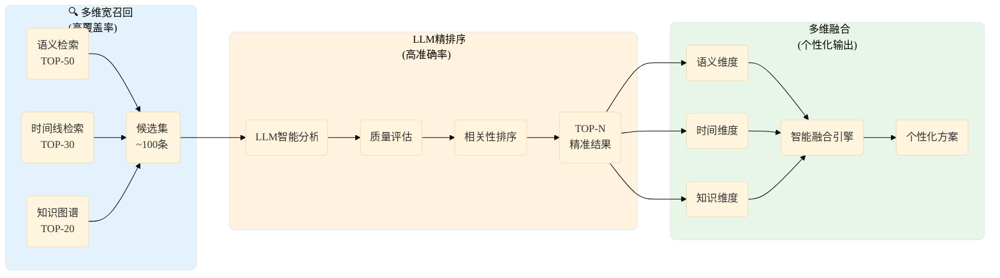
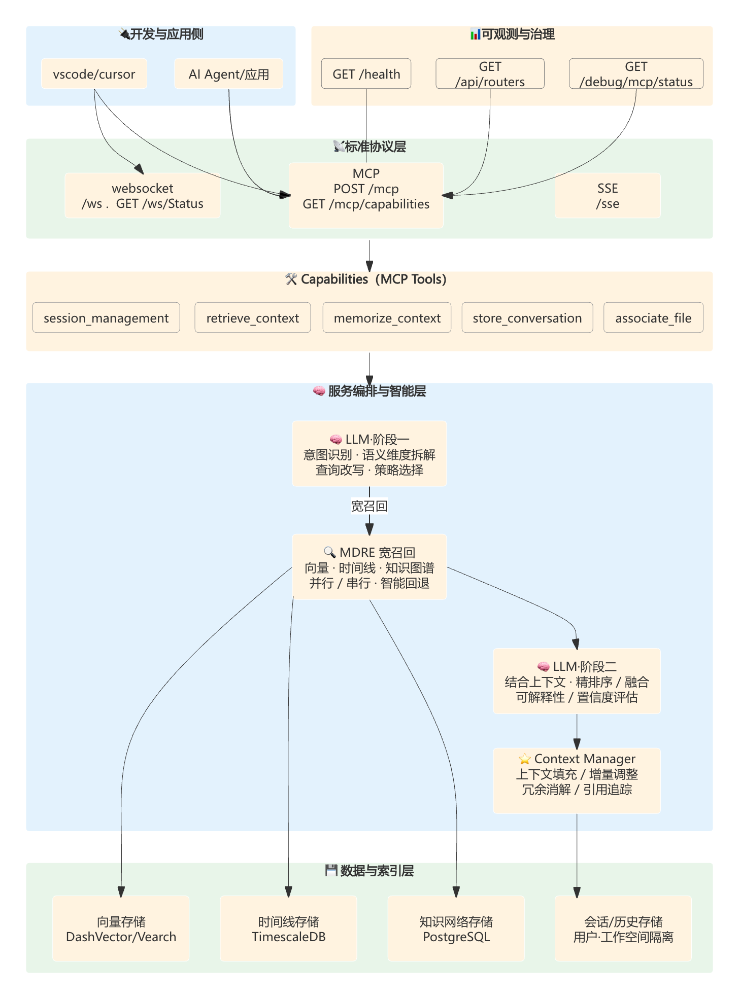
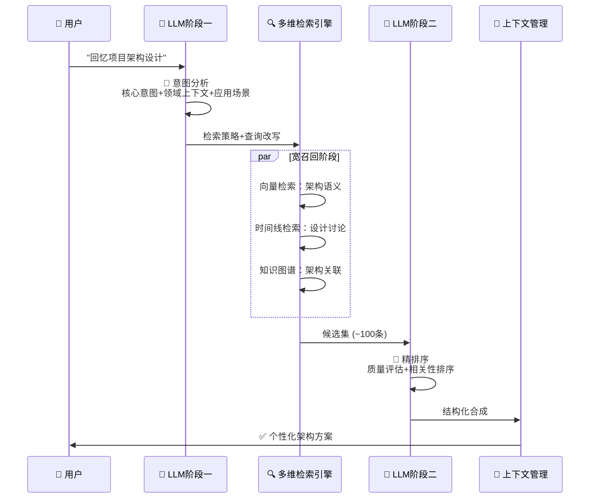
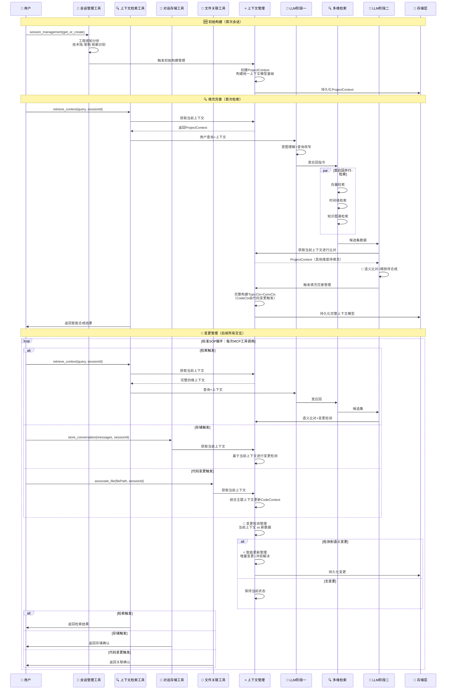
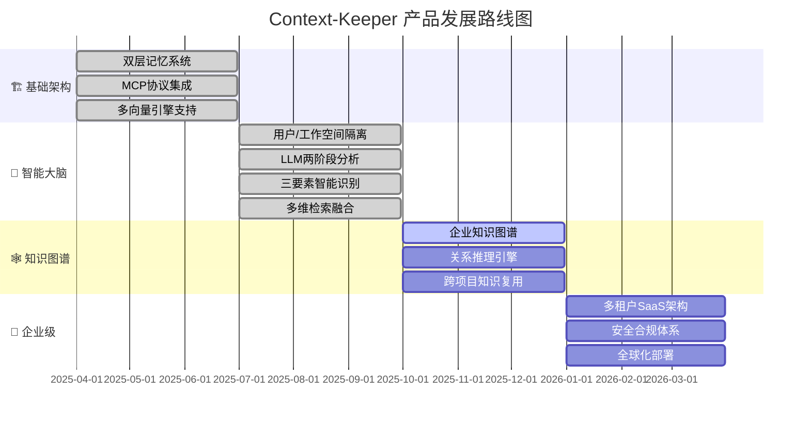
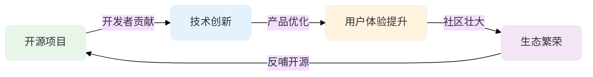

<div align="center" style="margin: 40px 0;">

<div style="display: flex; align-items: center; justify-content: center; gap: 20px; margin-bottom: 30px;">

<span style="font-size: 48px; font-weight: bold; color: #1e293b;">Context-Keeper</span>
</div>

**基于LLM驱动的智能记忆与上下文管理系统**

*重新定义AI助手的记忆边界，让每一次对话都有意义*

[](https://github.com/redleaves/context-keeper)
[](LICENSE)
[](https://golang.org/)
[](https://github.com/modelcontextprotocol)

[🚀 立即体验](#5-分钟快速开始) • [💡 核心优势](#2-核心特性) • [🏗️ 架构设计](#3-架构设计) • [📖 部署指南](#4-部署与集成) • [🗺️ 发展规划](#5-产品发展路线图)

</div>

---

## 📋 **目录导航**

- [🎯 为什么选择Context-Keeper？](#1-ai时代的开发困境当智能工具遇到记忆断层)
- [🎯 核心特性](#2-核心特性)
- [🏗️ 架构设计](#3-架构设计)
- [📖 部署与集成](#4-部署与集成)
- [🗺️ 产品发展路线图](#5-产品发展路线图)
- [🤝 贡献指南](#6-贡献指南)

---

## 1. AI时代的开发困境：当智能工具遇到记忆断层

> **"还记得昨天讨论的微服务架构方案吗？"** → "抱歉，我不记得..." → 😤

### 📊 **四维痛点：你是哪一种？**

<div align="center">

|  | 👤 **个人开发者** | 👥 **团队Leader** | 🏗️ **项目经理** | 🏢 **企业高管** |
|------|-----------------|----------------|----------------|----------------|
| **💔 核心痛点** | 🔄 **每天重复解释**项目背景给AI<br/>🧠 **上下文丢失**：AI无法理解开发意图<br/>🌀 **重复劳动**：相似问题反复解决 | 📚 **知识断层**：老员工经验无法传承<br/>💬 **沟通成本高**：反复解释相同问题<br/>🚫 **决策延迟**：缺乏历史上下文参考 | 🔧 **技术债务**：历史决策原因不明<br/>⏱️ **项目延期**：新人上手周期长<br/>📋 **文档滞后**：代码与文档不同步 | 💸 **人才流失**：核心知识随人员离职<br/>📈 **ROI下降**：跨项目最佳实践难复用<br/>🎯 **竞争劣势**：创新速度被拖慢 |
| **⚡ 直接影响** | **🔥30%开发时间浪费** | **📉团队效率下降40%** | **💰项目成本超预算2x** | **⏰人才培养成本6-12个月** |

</div>

### 🔥 **行业现状数据**
- 📊 **50%开发者**每天重复解释项目背景给AI助手
- 💰 **平均成本**：替换一个资深工程师需要6-12个月
- ⏱️ **时间损失**：新人完全熟悉复杂项目需要3-6个月
- 🔄 **重复工作**：团队中30-40%的技术问题是重复性的

**核心问题**：AI工具缺乏持续记忆能力，无法形成智能的知识积累和传承体系。面对这些困境，我们需要的不是另一个记忆工具，而是一个真正理解开发者意图的智能大脑。🚀 **Context-Keeper：突破传统边界的智能解决方案**


---

## 2. 核心特性




### 🚀 **三大核心突破**

| 突破点 | 传统方案痛点 | **Context-Keeper解决方案** | 核心优势 |
|-------|------------|-------------------------|---------|
| **🧠 智能推理** | 机械匹配，无法理解意图 | **LLM深度推理**：理解开发场景和项目上下文 | 准确率75%+ |
| **⚡ 宽召回+精排序** | 召回率与准确率矛盾 | **两阶段架构**：宽召回(100条) → 精排序(TOP-N) | 覆盖率80%+ |
| **🎯 多维融合** | 单一语义检索，信息孤立 | **三维记忆空间**：语义+时间+知识智能融合 | 关联发现率3倍提升 |


### 🎯 **业务价值**

#### **对开发团队的价值**


| 应用场景 | 开发者问题 | Context-Keeper智能响应 | 价值体现 |
|---------|-----------|----------------------|---------|
| **架构决策回顾** | "为什么选择微服务而非单体？" | 基于3月15日技术评审记录的详细分析 | 🧠 **历史智慧复用** |
| **Bug修复复用** | "类似性能问题怎么解决？" | 发现2个相关案例并提供解决方案 | ⚡ **经验快速复用** |
| **技术选型参考** | "Redis集群配置最佳实践？" | 项目历史配置+业界最佳实践对比 | 🎯 **决策支持优化** |

#### **对企业的价值**
- 📈 **开发效率提升**: 减少重复性解释和讨论
- 💰 **人力成本节省**: 新员工培训时间大幅度缩短
- 🎯 **决策质量提升**: 基于历史经验的智能建议
- 🔄 **知识资产积累**: 团队智慧的系统性沉淀

---

## 3. 架构设计
Context-Keeper目前经历了两个版本的迭代：
#### **🧠 一期核心设计**

**📚 长短期记忆分层设计**
- **短期记忆**：存储完整的近期对话，使用本地文件系统，保证高速访问
- **长期记忆**：存储关键信息摘要，使用向量数据库永久保存
- **渐进式压缩**：信息从短期记忆的详细记录逐步转化为长期记忆的语义摘要

**👤 用户隔离与个性化**
- **会话隔离**：每个用户拥有独立的会话空间，确保数据安全和隐私保护
- **工作空间隔离**：不同项目/工作空间的上下文完全隔离，避免信息串扰
- **个性化记忆策略**：根据用户工作风格自动调整记忆阈值和摘要策略
- **跨会话知识传递**：在同一用户的不同会话间建立智能关联

**🔄 记忆与批次管理机制**
- **记忆ID (memoryID)**：用户视角的"完整记忆"，对应一个工作任务或主题
- **批次ID (batchID)**：系统视角的"存储单元"，对应连续对话片段
- **智能重要性评估**：自动识别关键决策点，确保核心内容永久保存

#### **🚀 二期LLM驱动升级**

Context-Keeper基于**LLM驱动的智能上下文记忆管理系统**，在一期基础上实现了两个关键突破：

🧠 **LLM驱动的宽召回+精排序架构** - 构建"意图理解 → 宽召回 → 精排序 → 智能合成"的LLM驱动架构

⭐️ **智能上下文管理** - 四维统一上下文模型+LLM驱动的全生命周期智能管理

---

### 🧠 **3.1 LLM驱动的宽召回+精排序架构**

#### **🏗️ 架构图**

<div align="center">

</div>


#### **⏱️ 时序图**



#### **📋 架构核心特性**

| 层级 | 核心能力 | 技术实现 | 性能优势 |
|------|---------|---------|---------|
| **🧠 智能层** | 两阶段LLM协同推理 | 意图分析+智能合成分工 | **准确率75%** |
| **🔍 检索层** | 多维宽召回+精排序 | 语义+时间+知识并行检索 | **召回率80%+** |
| **⭐️ 管理层** | 智能上下文管理 | 四维协同+实时同步 | **响应<500ms** |

### 📋 **3.2 智能上下文管理**

Context-Keeper构建了**四维统一上下文模型**作为上下文信息的载体，通过LLM驱动的智能管理机制，实现上下文从初始构建→填充完善→智能分析&更新上下文（循环往复）的全生命周期管理

**核心设计**：
- 🏗️ **统一上下文模型**：四维协同的数据存储基石
- 🔄 **智能管理过程**：LLM驱动的全生命周期管理机制
- ⚡️ **实时变更感知**：语义级别的上下文变化检测与更新

#### **🏗️ 智能上下文管理分层架构**

<div align="center">

</div>

#### **⏱️ 智能上下文管理时序**




**🔥 管理机制核心优势**：
- ✅ **统一存储基石**：四维统一上下文模型作为所有管理操作的数据基础
- ✅ **全生命周期覆盖**：从初始构建→填充完善→循环变更的完整管理链路  
- ✅ **LLM智能驱动**：每个管理环节都有LLM参与决策，非传统规则引擎
- ✅ **实时变更感知**：基于语义分析的上下文变化检测
- ✅ **无冲突合并**：LLM驱动的智能冲突解决和优先级仲裁

---

## 4. 部署与集成

### 🛠️ **前置准备**

在部署Context-Keeper之前，需要准备以下基础设施：

#### **📊 多维存储基础设施**

**1. 向量数据库（必需）**

我们设计了统一的向量存储接口，**可按照开发者/企业需要自行扩展**，支持多种向量数据库：

- **阿里云DashVector**：可在阿里云控制台快速申请
- **京东云Vearch**：可在京东云快速申请
- **自定义实现扩展**：基于统一接口可扩展实现其他向量存储（如Milvus、Weaviate等）

```bash
# 配置示例（二选一）
# 选项1：使用阿里云DashVector
VECTOR_STORE_TYPE=aliyun
VECTOR_DB_URL=https://your-instance.dashvector.cn-hangzhou.aliyuncs.com
VECTOR_DB_API_KEY=your-dashvector-api-key

# 选项2：使用京东云Vearch  
VECTOR_STORE_TYPE=vearch
VEARCH_URL=http://your-vearch-instance.jd.local
VEARCH_USERNAME=your-username
VEARCH_PASSWORD=your-password
```

**2. 时序数据库（必须）**

自行安装：**TimescaleDB/PostgreSQL**（用于时间线存储）

**3. 图数据库（必须）**

自行安装：**Neo4j**（用于知识图谱和关联分析）

**4. LLM模型配置（必须）**

我们支持本地和云端大模型配置，**灵活满足不同场景需求**：

**🏠 本地模型（推荐）**
- 基于**Ollama**框架，响应快、成本低、数据安全
- 安装Ollama：`curl -fsSL https://ollama.ai/install.sh | sh`
- 按需安装模型：`ollama pull deepseek-coder-v2:16b`
- 支持模型：CodeQwen、DeepSeek Coder、Llama等

**☁️ 云端模型（备用）**
- 申请对应LLM厂商的API密钥即可
- 支持：OpenAI、DeepSeek、Claude、通义千问等
- 配置简单，按需调用

###  **5分钟快速开始**

#### **环境要求**
- Go 1.21+
- 4GB+ 内存
- 支持Docker环境（可选）

#### **一键本地部署**

```bash
# 1. 获取Context-Keeper
git clone https://github.com/redleaves/context-keeper.git
cd context-keeper

# 2. 环境配置（重要！）
cp config/env.template config/.env

# 编辑配置文件，填入必要参数
vim config/.env
```

### ⚙️ **详细参数配置**

#### **真实配置文件说明**

基于项目实际的 `config/.env` 配置文件：

```bash
# =================================
# 基础服务配置
# =================================
SERVICE_NAME=context-keeper         # 服务名称
PORT=8088                          # HTTP服务端口
DEBUG=false                        # 调试模式
STORAGE_PATH=./data                # 数据存储路径

# =================================
# 向量存储配置（必需）
# =================================
# 向量存储类型: aliyun | vearch
VECTOR_STORE_TYPE=aliyun           # 支持阿里云DashVector和京东云Vearch

# 阿里云DashVector配置
VECTOR_DB_URL=https://your-instance.dashvector.cn-hangzhou.aliyuncs.com
VECTOR_DB_API_KEY=your-dashvector-api-key
VECTOR_DB_COLLECTION=context_keeper
VECTOR_DB_DIMENSION=1536
SIMILARITY_THRESHOLD=0.4

# 京东云Vearch配置（可选替代）
VEARCH_URL=http://your-vearch-instance.jd.local
VEARCH_USERNAME=root
VEARCH_PASSWORD=your-password
VEARCH_DATABASE=db
VEARCH_REQUIRED_SPACES=context_keeper_vector,context_keeper_users

# =================================
# Embedding服务配置（必需）
# =================================
EMBEDDING_API_URL=https://dashscope.aliyuncs.com/compatible-mode/v1/embeddings
EMBEDDING_API_KEY=your-dashscope-api-key

# 批量Embedding配置
BATCH_EMBEDDING_API_URL=https://dashscope.aliyuncs.com/api/v1/services/embeddings/text-embedding/text-embedding
BATCH_QUEUE_SIZE=100
BATCH_WORKER_POLL_INTERVAL=5s

# =================================
# LLM配置（重点：支持本地和云端模型）
# =================================
# 🌟 支持本地和云端模型，本地模型响应快、灵活，适合语义分析和识别
LLM_PROVIDER=ollama_local          # 默认使用本地模型
LLM_MODEL=deepseek-coder-v2:16b    # 本地代码理解模型
LLM_MAX_TOKENS=80000               # 最大Token数
LLM_TEMPERATURE=0.1                # 温度参数（精确分析）
LLM_TIMEOUT_SECONDS=600            # 超时时间

# 云端模型API Keys（备用）
DEEPSEEK_API_KEY=your-deepseek-key  # DeepSeek云端API
OPENAI_API_KEY=your-openai-key      # OpenAI API
CLAUDE_API_KEY=your-claude-key      # Claude API


# 时间线存储（TimescaleDB/PostgreSQL）
TIMELINE_STORAGE_ENABLED=true
TIMESCALEDB_HOST=localhost
TIMESCALEDB_PORT=5432
TIMESCALEDB_DATABASE=context_keeper_timeline
TIMESCALEDB_USERNAME=your-username
TIMESCALEDB_PASSWORD=your-password

# 知识图谱存储（Neo4j）
KNOWLEDGE_GRAPH_ENABLED=true
NEO4J_URI=bolt://localhost:7687
NEO4J_USERNAME=neo4j
NEO4J_PASSWORD=your-neo4j-password
NEO4J_DATABASE=neo4j

# =================================
# 会话管理配置
# =================================
SESSION_TIMEOUT=120m               # 会话超时时间（分钟）
CLEANUP_INTERVAL=30m               # 清理任务间隔
SHORT_MEMORY_MAX_AGE=3            # 短期记忆保留天数
```

#### **LLM模型选择配置**

基于项目实际的 `config/llm_config.yaml` 配置文件：

**🌟 重点特性：支持本地和云端模型，本地模型响应快、灵活，特别适合语义分析和识别任务**

```yaml
llm:
  default:
    primary_provider: "ollama_local"    # 🔥 优先使用本地模型
    fallback_provider: "deepseek"      # 云端模型作为备用
    
  providers:
    # 🏠 本地模型配置（推荐）
    ollama_local:
      base_url: "http://localhost:11434"
      model: "deepseek-coder-v2:16b"   # 默认本地模型
      timeout: "60s"                   # 本地响应更快
      rate_limit: 0                    # 无限流限制
      available_models:                # 支持多种本地模型
        - "codeqwen:7b"               # 代码生成专用
        - "deepseek-coder:33b"        # 高性能代码模型
        - "deepseek-coder-v2:16b"     # 新一代代码模型
    
    # ☁️ 云端模型配置（备用）
    deepseek:
      api_key: "${DEEPSEEK_API_KEY}"
      model: "deepseek-chat"
      timeout: "120s"
      rate_limit: 6000
      
    openai:
      api_key: "${OPENAI_API_KEY}"
      model: "gpt-3.5-turbo"
      
    claude:
      api_key: "${CLAUDE_API_KEY}"
      model: "claude-3-sonnet-20240229"
```

#### **配置参数详解**

| 参数分类 | 参数名 | 必需 | 说明 | 默认值 |
|---------|--------|------|------|--------|
| **基础服务** | `SERVICE_NAME` | ✅ | 服务名称 | `context-keeper` |
| | `PORT` | ✅ | HTTP服务监听端口 | `8088` |
| | `STORAGE_PATH` | ✅ | 数据存储目录 | `./data` |
| **向量存储** | `VECTOR_STORE_TYPE` | ✅ | 向量数据库类型：aliyun/vearch | `aliyun` |
| | `VECTOR_DB_URL` | ✅ | 阿里云DashVector地址 | - |
| | `VECTOR_DB_API_KEY` | ✅ | DashVector API密钥 | - |
| | `VEARCH_URL` | ❌ | 京东云Vearch地址 | - |
| | `VEARCH_USERNAME` | ❌ | Vearch用户名 | `root` |
| **Embedding** | `EMBEDDING_API_URL` | ✅ | 阿里云嵌入服务地址 | DashScope API |
| | `EMBEDDING_API_KEY` | ✅ | DashScope API密钥 | - |
| **LLM模型** | `LLM_PROVIDER` | ✅ | LLM提供商：ollama_local/deepseek/openai | `ollama_local` |
| | `LLM_MODEL` | ✅ | 使用的模型名称 | `deepseek-coder-v2:16b` |
| | `LLM_MAX_TOKENS` | ❌ | 最大Token数 | `80000` |
| **时序存储** | `TIMELINE_STORAGE_ENABLED` | ✅ | 是否启用TimescaleDB | `true` |
| | `TIMESCALEDB_HOST` | ✅ | PostgreSQL主机地址 | `localhost` |
| | `TIMESCALEDB_DATABASE` | ✅ | 数据库名称 | `context_keeper_timeline` |
| **图数据库** | `KNOWLEDGE_GRAPH_ENABLED` | ✅ | 是否启用Neo4j | `true` |
| | `NEO4J_URI` | ✅ | Neo4j连接地址 | `bolt://localhost:7687` |
| | `NEO4J_USERNAME` | ✅ | Neo4j用户名 | `neo4j` |
| **会话管理** | `SESSION_TIMEOUT` | ❌ | 会话超时时间 | `120m` |
| | `SHORT_MEMORY_MAX_AGE` | ❌ | 短期记忆保留天数 | `7` |

#### **启动服务**

```bash
# 3. 一键启动
./scripts/manage.sh deploy http --port 8088

# 4. 验证部署
curl http://localhost:8088/health
# 预期输出: {"status":"healthy","version":"v2.0.0"}
```

#### **验证功能完整性**

```bash
# 测试MCP协议连接
curl -X POST http://localhost:8088/mcp \
  -H "Content-Type: application/json" \
  -d '{"jsonrpc":"2.0","id":1,"method":"tools/list"}'

# 测试智能记忆功能  
curl -X POST http://localhost:8088/mcp \
  -H "Content-Type: application/json" \
  -d '{
    "jsonrpc":"2.0","id":2,"method":"tools/call",
    "params":{
      "name":"memorize_context",
      "arguments":{
        "sessionId":"test_session",
        "content":"这是一个架构设计讨论，采用微服务模式"
      }
    }
  }'

# 测试智能检索功能
curl -X POST http://localhost:8088/mcp \
  -H "Content-Type: application/json" \
  -d '{
    "jsonrpc":"2.0","id":3,"method":"tools/call",
    "params":{
      "name":"retrieve_context", 
      "arguments":{
        "sessionId":"test_session",
        "query":"架构设计"
      }
    }
  }'
```

### 💻 **IDE深度集成**

#### **Cursor/Qoder集成**

**步骤1：配置MCP连接**
```json
{
  "mcpServers": {
    "context-keeper": {
      "url": "http://localhost:8088/mcp"
    }
  }
}
```

**步骤2：安装智能记忆规则**
```bash
# 复制预置的记忆管理规则（或者根据IDE实际情况拷贝复制）
cp .cursor/rules/memory-rules.md ~/.cursor/rules/context-keeper.md

# 规则内容预览
cat ~/.cursor/rules/context-keeper.md
# 包含：自动代码关联、实时记忆同步、智能检索提示等
```

**步骤3：验证集成效果**
```typescript
// 在Cursor中测试
你: "帮我回忆一下这个项目的Redis缓存策略"
AI: [自动触发Context-Keeper检索]
   "根据8月15日的架构讨论，你们选择了Redis集群模式，
    主要考虑了以下因素：[显示历史讨论详情]"
```

#### **VSCode集成**

```bash
# 安装扩展
code --install-extension context-keeper.cursor-integration
```

### ☁️ **生产环境部署**

#### **Docker部署（推荐）**

```bash
# 1. 构建镜像
docker build -t context-keeper:latest .

# 2. 使用Docker Compose部署
cat > docker-compose.yml << 'EOF'
version: '3.8'
services:
  context-keeper:
    image: context-keeper:latest
    ports:
      - "8088:8088"
    environment:
      - PORT=8088
      - LLM_PROVIDER=openai
      - OPENAI_API_KEY=${OPENAI_API_KEY}
      - VECTOR_PROVIDER=dashvector
      - DASHVECTOR_API_KEY=${DASHVECTOR_API_KEY}
    volumes:
      - ./data:/app/data
      - ./config:/app/config
    restart: unless-stopped
    healthcheck:
      test: ["CMD", "curl", "-f", "http://localhost:8088/health"]
      interval: 30s
      timeout: 10s
      retries: 3
EOF

# 3. 启动服务
docker-compose up -d

# 4. 查看服务状态
docker-compose ps
docker-compose logs -f context-keeper
```

### 🐳 **Docker部署**

#### **使用项目Dockerfile**

```bash
# 1. 构建镜像（使用项目提供的Dockerfile）
docker build -t context-keeper:latest .

# 2. 运行容器
docker run -d \
  --name context-keeper \
  -p 8088:8088 \
  -v $(pwd)/data:/app/data \
  -v $(pwd)/config:/app/config \
  --env-file config/.env \
  context-keeper:latest

# 3. 查看运行状态
docker ps
docker logs context-keeper
```

#### **Docker Compose部署（推荐）**

```bash
# 使用项目提供的docker-compose.yml
docker-compose up -d

# 查看服务状态
docker-compose ps
docker-compose logs -f context-keeper

# 停止服务
docker-compose down
```

---

## 5. 产品发展路线图

### 🎯 **技术演进战略**

Context-Keeper采用**阶梯式演进策略**，从基础记忆能力逐步升级为企业级AI大脑：



### 🔥 **第三阶段：知识图谱构建**（当前进行中）

**📅 时间窗口**: 2025年Q4  
**🎯 核心目标**: 构建企业级知识图谱和关系推理能力

#### **核心特性开发**

1. **🕸️ 企业知识图谱构建**
   ```typescript
   interface KnowledgeGraph {
     entities: ProjectEntity[];
     relationships: EntityRelationship[];
     concepts: ConceptNode[];
     contextClusters: ContextCluster[];
   }
   
   interface ProjectEntity {
     id: string;
     type: "function" | "module" | "concept" | "decision";
     properties: Record<string, any>;
     connections: EntityConnection[];
   }
   ```
   - **技术突破**: 自动从代码和对话中提取实体关系
   - **预期效果**: 构建项目的完整知识网络

2. **🧠 关系推理引擎**
   ```typescript
   interface ReasoningEngine {
     findRelatedConcepts(entity: string): ConceptPath[];
     inferMissingLinks(context: Context): InferredRelation[];
     explainDecisionPath(decision: Decision): ReasoningChain;
   }
   ```
   - **技术突破**: 多跳路径查询与智能推理
   - **预期效果**: 发现隐藏的知识关联

3. **🔄 跨项目知识复用**
   ```typescript
   interface CrossProjectKnowledge {
     patternMatching: PatternMatcher;
     bestPracticeExtraction: BestPracticeEngine;
     knowledgeTransfer: TransferLearning;
   }
   ```
   - **技术突破**: 跨项目的最佳实践自动识别和迁移
   - **预期效果**: 加速新项目的知识积累

**📊 预期量化目标**:
- 🎯 知识图谱覆盖率: 90%+
- ⚡ 关系推理准确率: 85%+  
- 🔧 跨项目知识复用率: 70%+

### 🏢 **第四阶段：企业级部署**（2026年Q1）

**🎯 核心目标**: 构建企业级SaaS服务和全球化部署能力

#### **企业级特性**

1. **🏗️ 多租户SaaS架构**
   - 租户数据完全隔离
   - 弹性资源分配
   - 企业级性能保障

2. **🔒 安全合规体系**
   - 数据加密和权限管理
   - 审计日志和合规报告
   - 企业级安全认证

3. **🌍 全球化部署**
   - 多区域部署支持
   - 国际化和本地化
   - 全球数据同步


---

## 6. 贡献指南

### 🌟 **开源社区愿景**

Context-Keeper致力于构建一个**开放、创新、共赢**的AI编程工具社区，让每一位开发者都能享受到智能记忆带来的效率提升。

#### **📈 社区发展目标**



### 🚀 **快速参与贡献**

#### **🔧 开发环境搭建**

```bash
# 1. Fork并克隆项目
git clone https://github.com/YOUR_USERNAME/context-keeper.git
cd context-keeper

# 2. 环境准备
go version  # 确保Go 1.21+
node --version  # 确保Node.js 16+

# 3. 依赖安装
go mod download
npm install

# 4. 本地开发启动
cp config/.env.example config/.env
go run main.go --dev

# 5. 运行测试套件
go test ./...
npm test

# 6. 代码质量检查
golangci-lint run
npm run lint
```

#### **📝 贡献流程**

```bash
# 1. 创建功能分支
git checkout -b feature/amazing-new-feature

# 2. 开发与测试
# ... 进行开发工作 ...
go test ./...

# 3. 提交代码（遵循Conventional Commits）
git add .
git commit -m "feat: add intelligent query rewriting engine

- Implement semantic query expansion
- Add multi-language support for query analysis  
- Integrate with LLM providers for intent recognition
- Add comprehensive test coverage

Closes #123"

# 4. 推送并创建PR
git push origin feature/amazing-new-feature
# 在GitHub上创建Pull Request
```

### 📋 **贡献方式与认可体系**

#### **🎯 多样化贡献途径**

| 贡献类型 | 技能要求 | 认可方式 | 影响力 |
|---------|----------|----------|--------|
| **🐛 Bug修复** | Go/TypeScript基础 | Contributor徽章 | 直接提升产品稳定性 |
| **✨ 功能开发** | 中高级编程技能 | Core Contributor | 推动产品能力演进 |
| **📚 文档完善** | 技术写作能力 | Documentation Expert | 降低新用户使用门槛 |
| **🧪 测试用例** | 测试思维与技能 | Quality Assurance | 保障产品质量 |
| **🌍 国际化** | 多语言能力 | Localization Champion | 扩大全球用户覆盖 |
| **🎨 UI/UX设计** | 设计与前端技能 | Design Contributor | 提升用户体验 |


---

## 🎊 **立即开始您的智能记忆之旅**

<div align="center">

**🧠 Context-Keeper - 重新定义AI助手的记忆边界**

*让每一次对话都有意义，让每一个决策都有传承*

### 🚀 **三步开启智能记忆时代**

```bash
# 1️⃣ 获取Context-Keeper
git clone https://github.com/context-keeper/context-keeper.git

# 2️⃣ 一键启动服务  
./scripts/manage.sh deploy http --port 8088

# 3️⃣ 集成到您的IDE
# Cursor用户：配置MCP连接
# VSCode用户：安装官方扩展
```

### 🎯 **选择最适合您的方案**

[](https://github.com/context-keeper/context-keeper/releases)
[](mailto:enterprise@context-keeper.com)
[](https://github.com/context-keeper/context-keeper/blob/main/CONTRIBUTING.md)

---

### 🔗 **快速链接**

| 🎯 场景 | 🔗 链接 | 📝 描述 |
|---------|--------|---------|
| **⚡ 快速体验** | [5分钟快速开始](#5分钟快速开始) | 最快速度上手体验 |
| **🏗️ 技术深入** | [系统架构设计](#3-架构设计) | 了解技术原理与创新 |
| **📖 部署指南** | [部署与集成](#4-部署与集成) | 生产环境部署方案 |
| **🗺️ 产品规划** | [发展路线图](#5-产品发展路线图) | 未来发展方向 |
| **🤝 参与贡献** | [贡献指南](#6-贡献指南) | 加入开源社区 |

---

**⭐ 如果Context-Keeper对您有帮助，请给我们一个Star！**

**📢 分享给更多需要智能记忆的开发者：**

[](https://twitter.com/intent/tweet?text=Context-Keeper%3A%20%E5%85%A8%E7%90%83%E9%A6%96%E4%B8%AALLM%E9%A9%B1%E5%8A%A8%E7%9A%84%E6%99%BA%E8%83%BD%E8%AE%B0%E5%BF%86%E7%B3%BB%E7%BB%9F%EF%BC%81&url=https://github.com/context-keeper/context-keeper)
[](https://www.linkedin.com/sharing/share-offsite/?url=https://github.com/context-keeper/context-keeper)

</div>

---

## 📄 **许可证与致谢**

### 📜 **开源许可**
本项目基于 [MIT License](LICENSE) 开源许可证，欢迎自由使用、修改和分发。

### 🙏 **特别致谢**

**🏆 核心贡献者**：
- [@weixiaofeng](https://github.com/weixiaofeng) - 项目发起人&首席架构师
- [@lixiao](https://github.com/lixiao) - LLM架构师

**🌍 社区支持**：
- [Model Context Protocol](https://github.com/modelcontextprotocol) - 协议标准支持
- [Go语言社区](https://golang.org/) - 技术生态与工具链
- [OpenAI开发者社区](https://platform.openai.com/) - AI技术生态支持

---

*Copyright © 2025 Context-Keeper Team. All rights reserved.*
