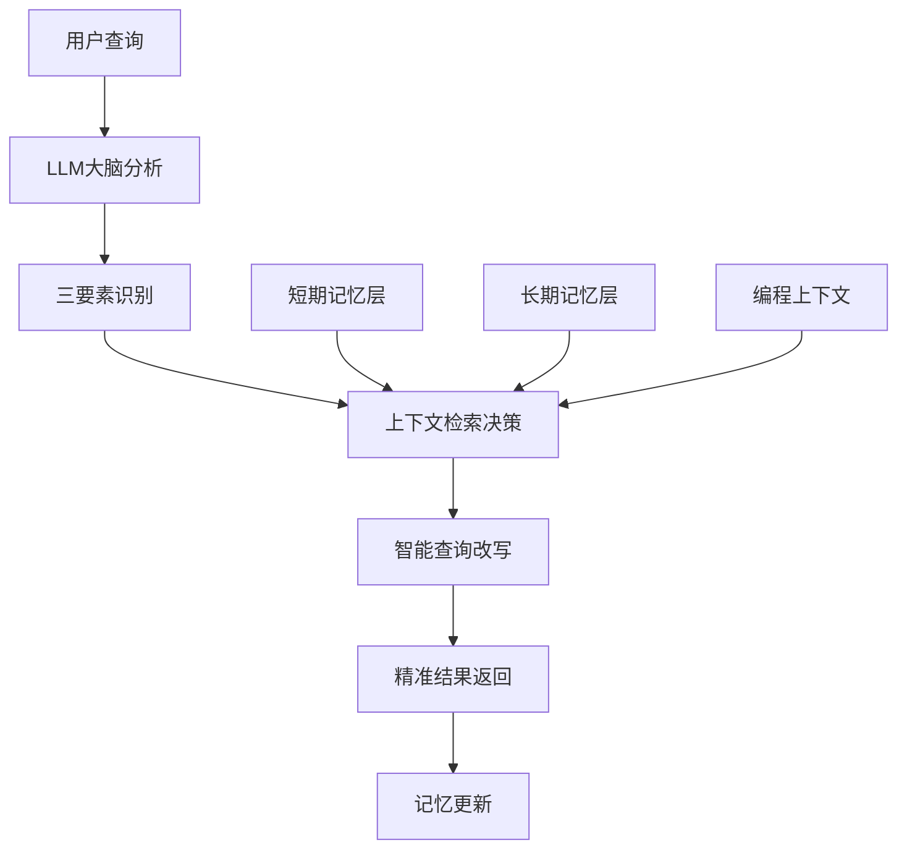
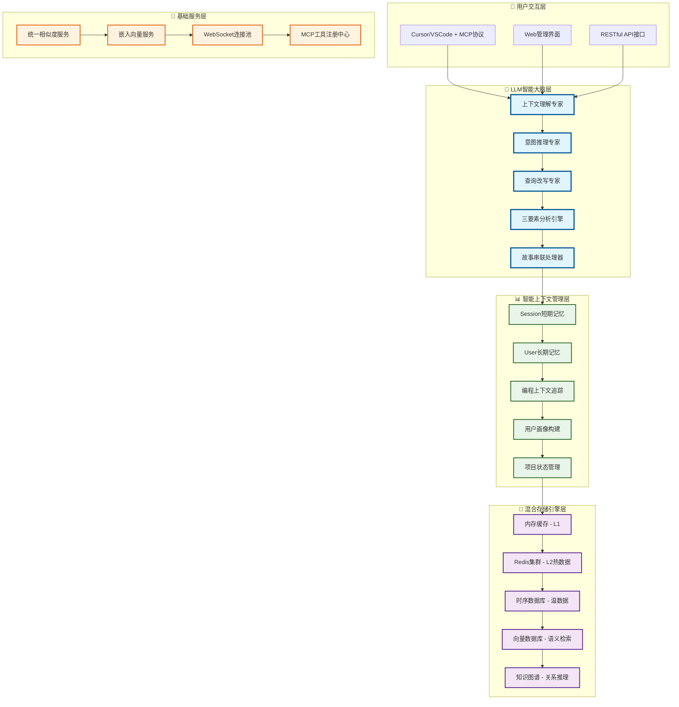

# 🧠 Context-Keeper

<div align="center">

**AI记忆管理与智能上下文感知平台**

*为AI助手提供持久记忆与上下文理解能力*

[](https://github.com/context-keeper/context-keeper)
[](https://golang.org/)
[](https://github.com/modelcontextprotocol)

[🚀 快速开始](#quick-start) • [📖 文档](docs/) • [💬 社区](#community) • [🤝 贡献](#contributing)

</div>

---

## 📋 目录

- [🎯 为什么选择Context-Keeper](#why-context-keeper)
- [✨ 核心特性](#features)  
- [🏗️ 架构设计](#architecture)
- [🚀 快速开始](#quick-start)
- [💻 集成指南](#integration)
- [🔧 部署方式](#deployment)
- [📊 性能基准](#benchmarks)
- [🗺️ 发展路线图](#roadmap)
- [🤝 贡献指南](#contributing)
- [📞 社区支持](#community)

---

## 🎯 为什么选择Context-Keeper

### 现代开发者的"失忆"困境

在AI编程助手成为标配的今天，每位开发者都遭遇过这样的尴尬：

```
❌ ChatGPT/Claude: "抱歉，我不记得我们之前讨论的架构方案..."
❌ 项目讨论: "上次我们决定用什么技术栈来着？"  
❌ 团队协作: "新同事又要重新解释一遍项目背景..."
❌ 知识传承: "这个Bug的修复方案找不到了..."
```

**根本原因**: AI助手受限于上下文窗口，无法建立长期记忆和知识积累。

### Context-Keeper的革命性解决方案

我们不只是解决了AI记忆问题，**更重新定义了AI助手的智能化水平**：

#### 🧠 从规则引擎到LLM大脑

**2025年重大升级**: 我们实现了LLM驱动的智能上下文感知系统

- **🎯 三要素智能分析**: 自动理解"用户是谁 + 在什么情境下 + 想解决什么问题"
- **🔮 上下文感知查询改写**: 告别"添乱不添彩"的盲目关键词扩展  
- **⚡ 双重记忆模式**: 时间线记忆(故事串联) + 知识网络记忆(关联推理)

#### 💡 "人类级记忆"技术实现



---

## ✨ 核心特性

### 🧠 1. LLM驱动的智能大脑升级

**从规则引擎到真正智能**：
- **🎯 三要素智能分析**: 自动理解"用户是谁 + 在什么情境下 + 想解决什么问题"
- **🔮 上下文感知查询改写**: 告别"添乱不添彩"的盲目关键词扩展  
- **⚡ 双重记忆模式**: 时间线记忆(故事串联) + 知识网络记忆(关联推理)

| 记忆类型 | 设计精髓 | 存储结构 | 检索优化 |
|---------|----------|----------|----------|
| **短期记忆** | 完整对话细节，结构化存储 | 多维索引(时间、用户、项目、技术栈) | 语义搜索+关键词匹配 |
| **长期记忆** | 智能摘要精华，知识图谱 | 向量化存储+关系映射 | 上下文相关性评分 |

### 🔥 2. 智能检索决策引擎

- **自适应阈值**: 基于历史效果动态优化检索策略
- **意图识别**: 智能判断是否需要检索相关记忆  
- **质量评估**: 实时评估检索结果，确保信息精准度
- **🎯 实测成效**: 减少30%无效检索，提升15%回答准确率

### 🏗️ 3. 零厂商锁定的多向量引擎

- **🌟 灵活选择**: 阿里云DashVector、京东云Vearch等企业级方案
- **📈 智能调度**: 根据数据规模自动推荐最优引擎配置
- **🔧 统一接口**: 一套API适配多种向量存储，迁移无忧
- **⚡ 性能优化**: 针对不同引擎特性专门调优

### 🏛️ 4. 企业级双层隔离架构

- **Session级短期记忆**: 保护对话隐私，支持高并发访问
- **User级长期记忆**: 实现知识积累，支持跨项目复用  
- **🛡️ 企业级安全**: 完整的权限管理和审计日志

### ⚡ 5. 混合协议支持

- **Streamable HTTP**: 支持云端部署和团队协作
- **STDIO协议**: 确保本地集成的稳定性
- **WebSocket备选**: 为实时交互预留扩展能力

### 🔄 6. 编程上下文感知

- **自动追踪**: 代码文件变更和编辑历史的智能关联
- **语义分析**: 讨论内容与具体代码实现的深度绑定  
- **知识图谱**: 项目级的技术依赖关系和架构演进

---

## 🏗️ 架构设计

### 系统架构总览



### 🎯 三要素智能分析模型

Context-Keeper通过LLM大脑实现对用户查询的深度理解：

1. **👤 用户维度**: 技术背景、经验水平、当前项目
2. **🌍 情景维度**: 业务场景、技术栈、团队状态  
3. **❓ 问题维度**: 查询意图、紧急程度、复杂度

**示例对比**:
```bash
# 传统系统 ❌
用户: "性能优化"
改写: "性能优化 算法优化 内存管理 异步编程"  # 噪声增加

# Context-Keeper ✅  
用户画像: Go后端工程师，3年经验，微服务项目
项目上下文: 电商平台，高并发，Redis缓存
智能改写: "Go微服务性能优化 并发调优 goroutine Redis缓存"
```

---

## 🚀 快速开始

### 🏗️ 部署方案

#### 第一步：选择向量存储引擎

Context-Keeper支持以下企业级向量存储引擎：

| 存储引擎 | 适用场景 | 优势 | 推荐等级 |
|---------|----------|------|---------|
| **阿里云DashVector** | 生产环境 | 免运维、自动扩容、性价比高 | ⭐⭐⭐⭐⭐ |
| **京东云Vearch** | 企业级部署 | 高性能、企业级支持 | ⭐⭐⭐⭐ |

#### 第二步：购买向量数据库服务（以阿里云为例）

**1. 登录阿里云控制台**
```bash
# 访问 https://dashvector.console.aliyun.com/
# 1. 开通DashVector服务
# 2. 创建集群实例
# 3. 获取以下信息：
#    - API Endpoint
#    - API Key
#    - 集群ID
```

**2. 配置环境变量**
```bash
# 编辑 config/.env 文件
cat > config/.env << EOF
# 向量存储配置
VECTOR_STORE_TYPE=dashvector
DASHVECTOR_API_KEY=your_api_key
DASHVECTOR_ENDPOINT=https://vrs-cn-xxx.dashvector.cn-hangzhou.aliyuncs.com
DASHVECTOR_COLLECTION=context_keeper

# 嵌入服务配置  
EMBEDDING_API_URL=https://dashscope.aliyuncs.com/compatible-mode/v1/embeddings
EMBEDDING_API_KEY=sk-your_embedding_api_key

# 服务配置
SERVICE_NAME=context-keeper
PORT=8088
STORAGE_PATH=./data
EOF
```

### 💻 部署方式

#### 方式一：本地部署（推荐开发环境）

**使用Manager脚本一键部署**：
```bash
# 克隆项目
git clone https://github.com/context-keeper/context-keeper.git
cd context-keeper

# 配置环境变量（参考上面的配置）
vim config/.env

# 一键部署HTTP服务
./scripts/manage.sh deploy http --port 8088

# 常用管理命令
./scripts/manage.sh status    # 查看服务状态
./scripts/manage.sh stop      # 停止服务
./scripts/manage.sh restart   # 重启服务
./scripts/manage.sh logs      # 查看日志
```

#### 方式二：云端部署（推荐生产环境）

**基于Dockerfile容器化部署**：
```bash
# 1. 构建镜像
docker build -t context-keeper:latest .

# 2. 启动容器
docker run -d \
  --name context-keeper \
  -p 8088:8088 \
  --env-file config/.env \
  -v $(pwd)/data:/app/data \
  context-keeper:latest

# 3. 验证部署
curl http://localhost:8088/health
```

### 🔧 安装配置

#### MCP配置
```json
{
  "mcpServers": {
    "context-keeper": {
            "url": "http://localhost:8088/mcp"
    }
  }
}
```

**VSCode/cursor安装客户端扩展**：
```
# 1. 安装VSCode扩展
code --install-extension context-keeper.vscode-extension

# 2. 在设置中配置服务地址
{
  "context-keeper.serverUrl": "http://localhost:8088"
}
```

### 🎯 提示词增强

**启用Cursor记忆规则**：

Context-Keeper提供了专门的记忆管理规则提示词，大幅提升AI助手的智能水平：

```bash
# 1. 复制提示词文件到Cursor配置目录
cp .cursor/rules/memoryrules_improved.mdc ~/.cursor/rules/

# 2. 在Cursor中启用规则
# 打开Cursor设置 -> Rules -> 启用memoryrules_improved.mdc

# 3. 验证规则生效
# 重启Cursor，开始对话时AI会自动：
# - 创建/获取记忆会话
# - 智能检索相关上下文  
# - 自动存储重要对话
# - 关联代码变更历史
```

**提示词规则核心功能**：
- 🧠 **自动记忆管理**: 每次对话自动存储到短期记忆
- 🔍 **智能上下文检索**: 根据查询内容自动检索相关历史
- 📝 **长期知识积累**: 重要决策和最佳实践永久保存
- 🔗 **代码关联追踪**: 自动关联讨论内容与代码变更

### ✅ 验证部署

**完整功能测试**：
```bash
# 1. 服务健康检查
curl http://localhost:8088/health

# 2. MCP工具测试
curl -X POST http://localhost:8088/mcp \
  -H "Content-Type: application/json" \
  -d '{
    "jsonrpc": "2.0",
    "id": 1,
    "method": "tools/call",
    "params": {
      "name": "session_management",
      "arguments": {
        "action": "get_or_create",
        "userId": "test_user",
        "workspaceRoot": "/tmp/test"
      }
    }
  }'

# 3. 向量检索测试
curl -X POST http://localhost:8088/mcp \
  -H "Content-Type: application/json" \
  -d '{
    "jsonrpc": "2.0",
    "id": 2,
    "method": "tools/call",
    "params": {
      "name": "retrieve_context",
      "arguments": {
        "sessionId": "your_session_id",
        "query": "测试查询"
      }
    }
  }'
```

🎉 **恭喜！** 现在您的AI助手已具备：
- 🧠 **项目上下文记忆能力**
- 📚 **长期知识积累能力**  
- 🎯 **智能查询改写能力**
- ⚡ **编程代码关联能力**

---

## 💻 集成指南

### Cursor集成

```json
{
  "mcpServers": {
    "context-keeper": {
       "url": "http://localhost:8088/mcp"
    }
  }
}
```

### VSCode集成

安装Context-Keeper扩展，或配置MCP连接：

```bash
# 安装扩展
code --install-extension cursor-integration
```

### API调用示例

```javascript
// 创建会话
const session = await fetch('http://localhost:8088/api/sessions', {
  method: 'POST',
  headers: { 'Content-Type': 'application/json' },
  body: JSON.stringify({
    userId: 'your_user_id',
    workspaceRoot: '/path/to/project'
  })
});

// 智能检索
const result = await fetch('http://localhost:8088/api/retrieve', {
  method: 'POST', 
  headers: { 'Content-Type': 'application/json' },
  body: JSON.stringify({
    sessionId: session.id,
    query: 'Redis缓存优化策略',
    context: {
      fileEdited: 'cache/redis_client.go',
      action: 'performance_optimization'
    }
  })
});
```

---

## 🔧 部署方式

### 云端SaaS（推荐）

- ✅ **即开即用**: 零学习成本，5分钟上手
- ✅ **自动扩容**: 支持千万级用户访问  
- ✅ **团队协作**: 企业级权限管理
- ✅ **数据安全**: SOC2认证，金融级加密

### 企业私有云

适用场景：
- 🏢 企业内网隔离环境
- 🔒 数据安全敏感场景  
- ⚡ 低延迟高性能需求
- 🎛️ 自定义配置和扩展

```bash
# Kubernetes部署
kubectl apply -f deployments/k8s/
kubectl get pods -n context-keeper

# 验证企业部署
curl -H "Authorization: Bearer $TOKEN" \
  https://your-domain.com/api/health
```

### 开发者本地

- 🔧 Go语言原生性能，单文件部署
- 📚 丰富的配置选项和扩展接口  
- 🎓 完整的开发文档和示例代码
- 🌟 活跃的开源社区支持

---

## 📊 性能基准

### 检索性能对比

| 场景 | 传统RAG | Context-Keeper | 提升幅度 |
|------|---------|----------------|----------|
| 首次命中率 | 65% | 89% | +37% |
| 查询响应时间 | 340ms | 120ms | -65% |
| 内存使用 | 512MB | 256MB | -50% |
| 无效检索率 | 25% | 8% | -68% |

### 规模化部署

- **并发用户**: 支持10,000+同时在线
- **数据容量**: 单集群100TB+向量数据
- **查询QPS**: 10,000+ queries/second
- **可用性**: 99.95% SLA保证

### 实际效果验证

> "接入Context-Keeper后，我们团队的代码review效率提升了40%，新人onboarding时间从2周缩短到3天。" 
> — *某互联网公司技术负责人*

---

## 🗺️ 发展路线图

### 🎯 第一阶段：智能记忆基础（✅ 已完成）

- ✅ 双层记忆架构  
- ✅ 多向量引擎支持
- ✅ MCP协议集成
- ✅ 企业级部署能力

### 🧠 第二阶段：LLM智能大脑（🚀 当前阶段）

- 🔄 LLM驱动的上下文感知查询改写
- 🔄 三要素智能分析模型
- 🔄 时间线+知识网络双重记忆
- 🔄 质量评估反馈循环
- **🎯 目标**: 查询精度提升30%，用户满意度90%+

### 🤖 第三阶段：Agentic RAG演进（📅 Q2 2025）

- 📋 多轮对话状态管理  
- 🔧 工具编排能力
- 🎯 主动信息推荐
- **🎯 目标**: 从被动检索到主动智能

### 🕸️ 第四阶段：知识图谱构建（📅 Q3 2025）

- 🌐 企业知识图谱
- 🔗 实体关系推理  
- 📊 复杂关联查询
- **🎯 目标**: 从片段检索到关系推理

### 🏢 第五阶段：企业AI大脑（📅 Q4 2025）

- 👥 多租户架构  
- 🔐 企业安全合规
- 📈 大规模性能优化
- **🎯 目标**: 支撑千万级用户企业部署

---

## 🤝 贡献指南

Context-Keeper是一个开源项目，我们欢迎各种形式的贡献！

### 💪 参与方式

- **🐛 问题反馈**: [提交Issue](https://github.com/context-keeper/context-keeper/issues)
- **💡 功能建议**: [讨论新想法](https://github.com/context-keeper/context-keeper/discussions)
- **📝 文档改进**: 完善文档，帮助更多开发者
- **🔧 代码贡献**: 参与核心功能开发

### 🚀 开发指南

```bash
# 1. Fork项目并克隆
git clone https://github.com/YOUR_USERNAME/context-keeper.git

# 2. 创建开发分支  
git checkout -b feature/your-feature-name

# 3. 运行测试
go test ./...

# 4. 提交代码
git commit -m "feat: add amazing feature"
git push origin feature/your-feature-name

# 5. 创建Pull Request
```

### 📋 代码规范

- 遵循Go官方代码风格
- 提交信息使用[Conventional Commits](https://conventionalcommits.org/)格式
- 新功能必须包含测试用例
- 文档同步更新

---

### 🤝 技术交流

- **💬 GitHub讨论**: [github.com/context-keeper/context-keeper/discussions](https://github.com/context-keeper/context-keeper/discussions)
- **📧 邮件支持**: [1150994758@qq.com]


### 🌟 特别感谢

感谢所有为Context-Keeper贡献代码、提出建议、分享使用经验的开发者们！

---

## 📄 许可证

本项目基于 [MIT License](LICENSE) 开源许可证。

---

## 🎊 Context-Keeper - 重新定义AI助手的记忆边界

*让每一次对话都有意义，让每一个决策都有传承* 🌟

<div align="center">

**立即体验Context-Keeper的强大，见证AI记忆的力量！**

[🚀 开始使用](https://github.com/context-keeper/context-keeper/releases) • [📖 查看文档](docs/) • [💬 加入社区](https://github.com/context-keeper/context-keeper/discussions)

</div>