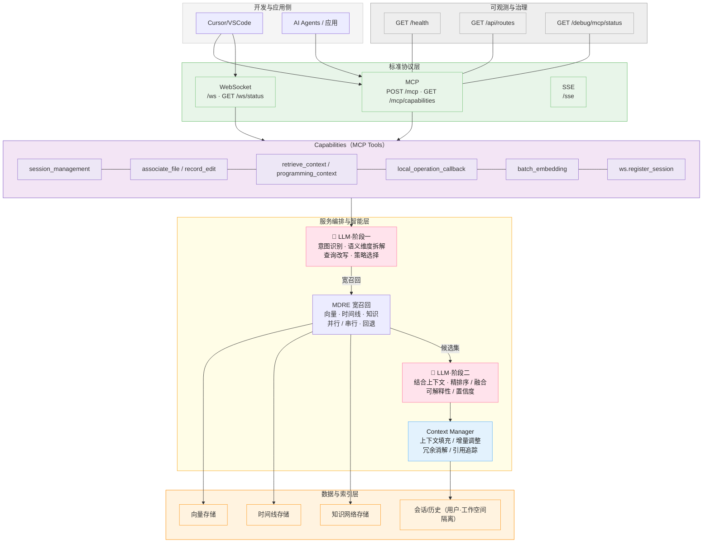
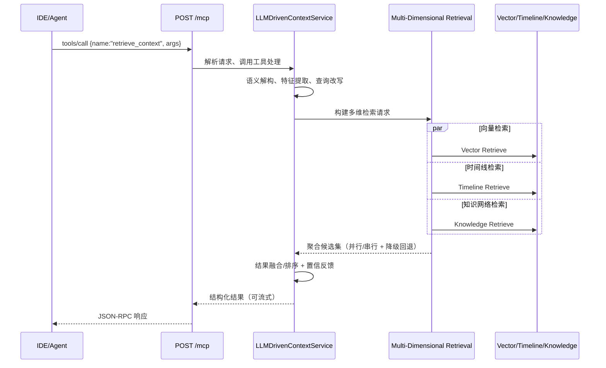
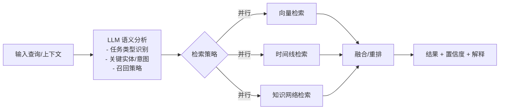
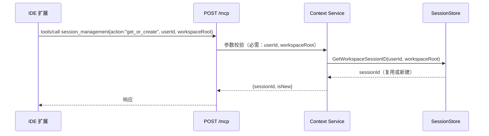
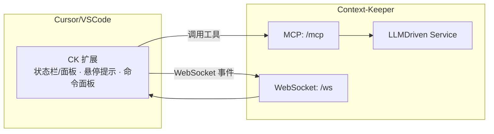
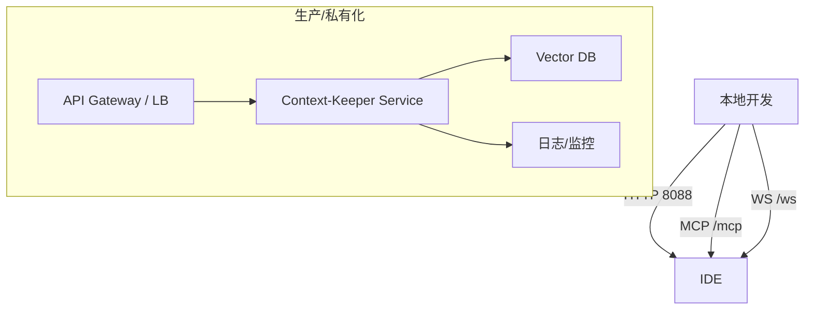

## Context-Keeper 架构白皮书（LLM 驱动版）

让每次对话都可累积，让每段代码都有来处。Context-Keeper 是面向工程与企业级场景的 AI 记忆与上下文操作系统，通过 LLM 驱动的多维分析与检索，将对话记忆、代码上下文、时间线与知识网络融为一体，提供稳健的 MCP Streamable HTTP 协议与 IDE 深度集成，支撑从个人开发到团队知识中台的演进。

参考仓库主页：[redleaves/context-keeper](https://github.com/redleaves/context-keeper)

---

## 总览架构（System Overview）




### 关键特性映射（Feature → Architecture）

- LLM-Driven Context Brain（两阶段）
  - 阶段一：`LLMStage1`（意图识别、语义维度拆解、查询改写、策略选择）
  - 阶段二：`LLMStage2`（结合上下文精排序/融合、可解释性/置信度）
  - 上下文管理：`Context Manager`（上下文填充/增量调整、冗余消解/引用追踪）
- Multi-Dimensional Retrieval
  - `MDRE` 并行/串行融合 向量（`VS`）+ 时间线（`TL`）+ 知识（`KG`），失败自动回退
- IDE-First
  - `Clients` 层中的 `Cursor/VSCode` + 下文“IDE 深度集成”图，自动关联文件（`associate_file`）、记录编辑（`record_edit`）、检索与高亮
- 开放协议 + 可观测
  - `Protocols` 层（`MCP`/`WS`/`SSE`），可观测端点在 `Observability` 层（`/health`、`/mcp/capabilities`、`/ws/status`）
- 企业就绪
  - 用户/工作空间隔离与会话生命周期：`SS`（会话/历史，隔离落盘），配合 `session_management` 与 `ws.register_session`
  - 可插拔向量库与 Embedding：`VS`（可替换后端），由配置控制启用

### 为什么不是“另一个记忆库”

- LLM 驱动的“多维检索与决策融合”：不仅是“存储 + 向量相似度”，引入时间线与知识维度，按需并行与降级策略，强调稳定可用与工程落地（见 `LLMStage1 → MDRE → LLMStage2` 主干）
- IDE 双向联动：在真实编码活动中自动“关联/记录/检索/回放”，贯通“会话记忆”与“代码上下文”，减少人为负担（见 Capabilities 分层与 IDE 集成图）
- 能力即服务（MCP）：MCP 工具作为应用契约，对 IDE 与上层 Agent 统一开放（例如企业自研或 `joyagent-jdgenie` 对接）
- 轻量与自托管友好：Go 单体、最小依赖、可插拔后端、本地/私有云/公有云一致体验

关键实现文件：
- 协议与入口：`cmd/server/main_http.go`、`internal/api/streamable_http.go`
- 工具与路由：`internal/api/handlers.go`
- LLM 驱动服务：`internal/services/context_service.go`（集成 LLM 分析与多维存储/检索）
- 多维检索引擎：`internal/engines/multi_dimensional_retrieval/engine.go`、`internal/engines/retrieval_integration.go`
- 会话存储与隔离：`internal/store/user_session_manager.go`、`internal/store/session_store.go`
- IDE 集成：`cursor-integration/`（Cursor/VSCode 扩展）

---

## 端到端请求链路（MCP 工具调用）



要点：
- 并行/串行策略由配置与场景感知决定，失败自动回退到传统路径，保障可用性。
- Streamable HTTP 兼容 MCP 工具协议，支持 IDE/Agent 统一对接。

---

## LLM 驱动的多维检索（MDRE）



工程实现亮点：
- `internal/engines/multi_dimensional_retrieval/engine.go`：并行/串行检索与结果融合
- `internal/engines/retrieval_integration.go`：集成入口、失败回退与排序
- `internal/services/context_service.go`：多维度向量存储策略与降级兜底

---

## 记忆分层与数据模型

- 短期记忆：会话级滚动窗口，供即时决策与检索特征参考
- 长期记忆：重要知识沉淀并索引，支持跨会话复用
- 编程上下文：文件关联、编辑记录、变更追踪，与 IDE 实时联动

隔离模型：
- 用户隔离：`data/users/<userId>/...`
- 工作空间隔离：会话 ID 按 `userId + workspaceRoot` 哈希派生
- 会话生命周期：超时策略与自动续期

相关实现：`internal/store/user_session_manager.go`、`internal/store/session_store.go`

---

## 会话与工作空间隔离（Session & Workspace Isolation）



规范要求：
- `session_management.get_or_create` 必须携带 `userId` 与 `workspaceRoot`，否则拒绝（防串会话）。
- WebSocket 连接通过 `/api/ws/register-session` 将 `sessionId` 绑定到 `connectionId`，实现实时指令与回调。

---

## IDE 深度集成（Cursor/VSCode）



自动化钩子：
- 打开/保存文件：自动 `associate_file`
- 编辑变更：自动 `record_edit`（携带 diff）
- 命令面板：`retrieve_context`/`programming_context`

扩展源码：`cursor-integration/`（含 VSCode API 集成、WebSocket 管理、配置面板等）

---

## 部署拓扑（Deployment Topologies）



配置（`config/.env`）：
- 服务：`PORT`、`HOST`、`STORAGE_PATH`
- Embedding：`EMBEDDING_API_URL`、`EMBEDDING_API_KEY`
- 向量库：`VECTOR_DB_URL`、`VECTOR_DB_API_KEY`、`VECTOR_STORE_TYPE`
- 多维检索/存储开关：`ENABLE_MULTI_DIMENSIONAL_STORAGE`、`MULTI_DIM_*`

运行（示例）：
```bash
go build -o bin/context-keeper-http cmd/server/main.go cmd/server/main_http.go
./bin/context-keeper-http
```

健康检查与能力：
- `GET /health`、`GET /mcp/capabilities`、`GET /ws/status`

---

## 可观测性与可靠性

- 健康检查与端点自检：`/health`、`/mcp/capabilities`、`/debug/mcp/status`
- 并行检索与结果融合：最大化召回与稳定性
- 失败回退：多维检索异常时，自动回退到传统向量/规则检索
- 运行模式：HTTP/Streamable MCP 允许演示级运行；生产环境建议完整配置（Embedding + 向量库）

---

## 可扩展性（Extensibility）

- 工具扩展：按 MCP 规范新增工具（`internal/api/handlers.go` + 注册入口）
- 向量库可插拔：通过 `config/.env` 切换后端，实现厂商解耦
- 策略可配置：多维检索并行/串行、融合与排序阈值、降级路径

---

## 与业界产品的定位与对比（Feature Matrix）

> 目标对标：mem0、memOS、Context-Engineering、joyagent-jdgenie（能力侧接入）

| 能力维度 | Context-Keeper | mem0 | memOS | Context-Engineering | joyagent-jdgenie |
| --- | --- | --- | --- | --- | --- |
| 记忆分层（短期/长期/代码） | 是（三层合一） | 多数侧重长期/实体 | 中央记忆中台 | 方法学/工程规范 | Agent 能力框架 |
| LLM 驱动多维检索 | 向量+时间线+知识并行/回退 | 主要向量/片段 | 依产品方案 | 方法策略指导 | 由集成方实现 |
| IDE 深度集成（自动关联/记录/检索） | 原生 Cursor/VSCode | 需二次集成 | 依厂商实现 | 理论与模式 | 作为上层 Agent 可对接 |
| MCP Streamable HTTP 协议 | 一等公民 | 依实现 | 依实现 | 非重点 | 可对接 |
| 企业就绪（隔离/治理/可观测） | 用户/工作空间隔离、健康/路由/状态端点 | 取决于部署 | 厂商级治理 | 理论为主 | 企业级实践丰富 |
| 扩展性（工具/向量库） | 工具即服务、可插拔向量库 | 依实现 | 依实现 | 方法论 | 强生态能力 |

定位结论：
- Context-Keeper 以 “LLM 驱动 + 多维检索 + IDE 双向联动 + MCP 标准化” 为核心卖点，强调工程可落地与企业就绪。
- 可作为 memOS 式“记忆中台”的自托管备选，也可作为 joyagent-jdgenie 等 Agent 平台的“上下文大脑”侧服务对接。

---

## API 概览

- MCP（Streamable HTTP）
  - 统一端点：`POST /mcp`
  - 能力探测：`GET /mcp/capabilities`
  - 常用工具：`session_management`、`associate_file`、`record_edit`、`retrieve_context`、`programming_context`

- WebSocket
  - 连接：`GET /ws`
  - 状态：`GET /ws/status`
  - 注册：`POST /api/ws/register-session`

- 健康与调试
  - `GET /health`、`GET /api/routes`、`GET /debug/mcp/status`

---

## 路线图（Roadmap 摘要）

- Agentic RAG：从被动检索到主动推荐与反事实校验
- 质量反馈循环：利用 LLM 评估检索片段质量并自我迭代
- 企业知识网络：实体-关系推理与跨域关联检索
- 团队协作：多租户、权限治理与审计合规

---

## 参考与链接

- 项目主页与代码：[redleaves/context-keeper](https://github.com/redleaves/context-keeper)
- 协议与端点实现：`cmd/server/main_http.go`、`internal/api/streamable_http.go`
- 多维检索引擎：`internal/engines/multi_dimensional_retrieval/engine.go`
- 上下文服务与存储：`internal/services/context_service.go`、`internal/store/*`
- IDE 集成：`cursor-integration/`


